<div align="center">

# Black-Scholes Option Pricing Model

### A Production-Grade Quantitative Finance Framework

[](https://python.org)
[](#testing)
[](#streamlit-web-app)
[](LICENSE)

**End-to-end implementation of the Black-Scholes-Merton (1973) framework with Monte Carlo validation, full Greek analytics, implied volatility extraction, sensitivity analysis, and an interactive Streamlit dashboard.**

[Features](#-features) · [Quick Start](#-quick-start) · [Architecture](#-architecture) · [Theory](#-theoretical-foundation) · [Results](#-results) · [Web App](#-streamlit-web-app)

---

</div>

<br>

## Overview

This project implements a **comprehensive option pricing pipeline** that mirrors the workflow of a quantitative analyst on a derivatives trading desk — from market data ingestion through model calibration, pricing, risk computation, and reporting.

It is designed to demonstrate deep understanding of:

- **Derivatives theory** — not just stocks, but the mathematics of options pricing
- **Numerical methods** — Monte Carlo simulation, root-finding algorithms, variance reduction
- **Risk management** — Greeks-based hedging, sensitivity analysis, scenario testing
- **Software engineering** — modular architecture, type safety, comprehensive testing, CI-ready design

```
                    ┌─────────────────────────────────────────────┐
                    │         OPTION PRICING PIPELINE              │
                    │                                             │
   Market Data ──► │  Data Pipeline ──► Black-Scholes Engine     │
   (yfinance)      │       │                  │                   │
                    │       ▼                  ▼                   │
                    │  Historical Vol    Greeks (Δ Γ Θ ν ρ)      │ ──► Streamlit App
                    │       │                  │                   │ ──► PDF Reports
                    │       ▼                  ▼                   │ ──► 14 Plot Types
                    │  Monte Carlo ◄──► Validation                │
                    │       │                  │                   │
                    │       ▼                  ▼                   │
                    │  Implied Vol ──► Sensitivity Analysis       │
                    └─────────────────────────────────────────────┘
```

<br>

## Key Features

### Pricing Engine
- **Black-Scholes-Merton** closed-form solution for European options with continuous dividend yield
- **10 analytical Greeks** — Delta, Gamma, Theta, Vega, Rho, Vanna, Volga (Vomma), Charm, Speed
- **Put-call parity** verification to machine precision (error ~10⁻¹⁴)

### Monte Carlo Simulation
- **Geometric Brownian Motion** (GBM) path simulation with 252-step discretization
- **Antithetic variates** — variance reduction by simulating mirror paths
- **Control variates** — anchoring estimates using known expected values
- **Convergence analysis** — demonstrating 1/√n error decay

### Implied Volatility
- **Newton-Raphson** root-finding with analytical Vega (quadratic convergence)
- **Brenner-Subrahmanyam** initial guess for robust starting point
- **Bisection fallback** when Newton-Raphson encounters degenerate cases
- **Volatility smile** construction across strike range

### Sensitivity Analysis
- **3D surface plots** — price, delta, gamma, theta, vega across two-parameter grids
- **Scenario matrix heatmaps** — spot × volatility stress testing
- **P&L diagrams** — payoff profiles with breakeven analysis
- **Parameter sweeps** — Greeks as a function of spot, time, volatility, and rates

### Data Pipeline
- **Live market data** via Yahoo Finance (any ticker: AAPL, TSLA, MSFT, etc.)
- **Historical volatility** at multiple windows (21d, 63d, 126d, 252d)
- **Return statistics** — skewness, kurtosis, Sharpe ratio
- **Synthetic data fallback** — GBM-generated data when offline

### Interactive Web App
- **7-page Streamlit dashboard** with dark theme and professional UI
- **Real-time computation** — results update as you change parameters
- **Interactive Plotly charts** — rotatable 3D surfaces, zoomable 2D plots
- **PDF report generation** — downloadable analysis report for any stock

<br>

## Quick Start

### Prerequisites

```bash
Python 3.10+
pip (package manager)
```

### Installation

```bash
# Clone the repository
git clone https://github.com/yourusername/option-pricing-model.git
cd option-pricing-model

# Install dependencies
pip install -r requirements.txt
```

### Run the CLI Pipeline

```bash
# Full pipeline with live AAPL data
python main.py

# Custom parameters
python main.py --ticker TSLA --strike 250 --expiry 0.5 --vol 0.45

# All CLI options
python main.py --help
```

### Launch the Web App

```bash
streamlit run app.py
```

Then open `http://localhost:8501` in your browser.

### Run Tests

```bash
python -m pytest tests/ -v
```

<br>

## Architecture

### Project Structure

```
option-pricing-model/
│
├── app.py                      # Streamlit web application (1,119 lines)
├── main.py                     # CLI entry point with argparse
├── generate_thesis.py          # PDF thesis document generator
├── requirements.txt            # Python dependencies
│
├── src/                        # Core engine modules
│   ├── __init__.py
│   ├── black_scholes.py        # BSM pricing engine + 10 Greeks (154 lines)
│   ├── monte_carlo.py          # GBM simulation + variance reduction (135 lines)
│   ├── implied_volatility.py   # Newton-Raphson IV solver (123 lines)
│   ├── sensitivity.py          # Multi-dim parameter analysis (138 lines)
│   ├── visualization.py        # 14 matplotlib plot types (390 lines)
│   ├── data_pipeline.py        # Market data + historical vol (122 lines)
│   ├── pipeline.py             # 7-step orchestrator (288 lines)
│   └── config.py               # Dataclass configuration (61 lines)
│
├── tests/                      # Unit test suite
│   ├── test_black_scholes.py   # 22 tests — pricing, Greeks, edge cases
│   ├── test_monte_carlo.py     # 7 tests — convergence, variance reduction
│   └── test_implied_vol.py     # 6 tests — IV recovery, smile
│
├── outputs/
│   ├── plots/                  # 14 generated visualizations
│   └── reports/                # PDF thesis document
│
├── data/                       # Cached market data
└── .streamlit/
    └── config.toml             # Dark theme configuration
```

**Total: ~3,965 lines of Python | 35 unit tests | 14 plot types | 7-page web app**

### Module Dependency Graph

```
main.py / app.py
    │
    ▼
pipeline.py (orchestrator)
    │
    ├──► black_scholes.py ◄─── Core pricing engine
    │         ▲
    │         │
    ├──► monte_carlo.py ─────── Uses BS for benchmarking
    │         ▲
    │         │
    ├──► implied_volatility.py ─ Uses BS price + Vega
    │
    ├──► sensitivity.py ──────── Uses BS for parameter sweeps
    │
    ├──► visualization.py ────── Consumes all computation results
    │
    ├──► data_pipeline.py ────── Market data ingestion
    │
    └──► config.py ───────────── Typed configuration
```

### Design Patterns

| Pattern | Where | Why |
|---------|-------|-----|
| **Dataclass Config** | `config.py` | Type-safe parameter containers with validation and defaults |
| **Static Engine** | `black_scholes.py` | Stateless pricing — no instantiation overhead, enables vectorization |
| **Result Containers** | `BSResult`, `MCResult` | Structured output with all computed quantities for downstream use |
| **Graceful Degradation** | `data_pipeline.py` | Tries live data → falls back to synthetic GBM data |
| **Pipeline Orchestrator** | `pipeline.py` | 7-step sequential execution with structured logging |
| **Strategy Pattern** | `"call"/"put"` literals | Same engine handles both option types via type parameter |

<br>

## Theoretical Foundation

### The Black-Scholes-Merton Model

The BSM model (1973, Nobel Prize in Economics) prices European options under the assumption that the underlying follows geometric Brownian motion:

```
dS = (r - q)·S·dt + σ·S·dW
```

The closed-form solution:

```
Call = S·e^(-qT)·N(d₁) - K·e^(-rT)·N(d₂)
Put  = K·e^(-rT)·N(-d₂) - S·e^(-qT)·N(-d₁)

where:
    d₁ = [ln(S/K) + (r - q + σ²/2)·T] / (σ·√T)
    d₂ = d₁ - σ·√T
```

| Symbol | Meaning |
|--------|---------|
| `S` | Current spot price of the underlying asset |
| `K` | Strike price of the option contract |
| `T` | Time to expiration (in years) |
| `r` | Risk-free interest rate (continuous compounding) |
| `σ` | Volatility of the underlying (annualized) |
| `q` | Continuous dividend yield |
| `N(·)` | Standard normal cumulative distribution function |

### Greeks — Risk Sensitivities

Greeks measure how the option price changes in response to shifts in each input parameter. They are the foundation of **delta hedging** and **risk management**.

| Greek | Formula (Call) | Measures |
|-------|---------------|----------|
| **Delta (Δ)** | `e^(-qT)·N(d₁)` | Price sensitivity to spot movement ($1 move → Δ price change) |
| **Gamma (Γ)** | `e^(-qT)·n(d₁) / (S·σ·√T)` | Convexity — how fast delta itself changes |
| **Theta (Θ)** | `-(S·σ·e^(-qT)·n(d₁))/(2√T) - rKe^(-rT)N(d₂) + ...` | Time decay — value lost per day |
| **Vega (ν)** | `S·e^(-qT)·n(d₁)·√T` | Sensitivity to implied volatility (per 1%) |
| **Rho (ρ)** | `K·T·e^(-rT)·N(d₂)` | Sensitivity to interest rate changes (per 1%) |
| **Vanna** | `-e^(-qT)·n(d₁)·d₂/σ` | Cross-gamma: d(Delta)/d(σ) |
| **Volga** | `S·e^(-qT)·n(d₁)·√T·d₁·d₂/σ` | Vol-of-vol exposure: d(Vega)/d(σ) |
| **Charm** | `d(Delta)/dt` | Delta decay — how delta changes over time |
| **Speed** | `d(Gamma)/dS` | Third-order spot sensitivity |

### Monte Carlo Simulation

Discretized risk-neutral GBM:

```
S(t+Δt) = S(t) · exp[(r - q - σ²/2)·Δt + σ·√Δt·Z],    Z ~ N(0,1)
```

**Variance reduction techniques implemented:**

- **Antithetic Variates:** For each Z, also simulate -Z. The resulting negatively correlated pairs reduce estimator variance by ~30-50%.
- **Control Variates:** Use the known expectation E[S(T)] = S·e^((r-q)T) as a control. The optimal beta coefficient minimizes variance analytically.

### Implied Volatility Extraction

Newton-Raphson iteration with analytical Vega:

```
σ_{n+1} = σ_n - [BS(σ_n) - V_market] / Vega(σ_n)
```

- **Initial guess:** Brenner-Subrahmanyam (1988) approximation: `σ₀ ≈ √(2π/T) · C/S`
- **Convergence:** Quadratic — correct digits double each iteration
- **Fallback:** Bisection method for degenerate cases (near-zero Vega)

### Model Assumptions & Limitations

| Assumption | Reality | Extension |
|-----------|---------|-----------|
| Constant volatility | Volatility changes (VIX) | Heston stochastic vol |
| Log-normal returns | Fat tails, crashes | Merton jump-diffusion |
| Continuous trading | Discrete rebalancing | Transaction cost models |
| No transaction costs | Bid-ask spreads exist | Leland (1985) |
| European exercise only | American options exist | Binomial tree, LSM |
| Constant risk-free rate | Yield curve shifts | Hull-White interest rate |

<br>

## Results

### Sample Output (AAPL, Live Data)

```
════════════════════════════════════════════════════
 OPTION PRICING MODEL — FULL PIPELINE
════════════════════════════════════════════════════
─── Step 1: Data Ingestion ───
  Ticker: AAPL
  Current Spot: $253.07
  Historical Vol (63d): 24.50%
  Skewness: 0.8435
  Kurtosis: 13.4825

─── Step 2: Black-Scholes Pricing ───
  Call Price: $30.7400
  Put Price:  $18.3976
  Put-Call Parity Error: 1.42e-14
  Delta (Call/Put): 0.6280 / -0.3720
  Gamma: 0.006100
  Theta/day (Call/Put): -0.0497 / -0.0167
  Vega/1%: 0.9572

─── Step 3: Monte Carlo Simulation ───
  MC Call Price: $30.6868 (BS: $30.7400)
  MC Put Price:  $18.3444 (BS: $18.3976)
  Standard Error: $0.0555
  95% CI: [$30.578, $30.796]

─── Step 4: Implied Volatility ───
  Input Volatility: 0.2450
  Recovered IV: 0.2450
  Converged: True in 4 iterations

─── Step 5: Sensitivity Analysis ───
  Computed: Greeks vs Spot, Greeks vs Time
  Computed: Price/Delta/Gamma/Theta surfaces
  Scenario matrix: (9, 7)

─── Step 6: Generating Visualizations ───
  Generated 14 plots

════════════════════════════════════════════════════
 PIPELINE COMPLETE
════════════════════════════════════════════════════
```

### Validation Summary

| Check | Result | Status |
|-------|--------|--------|
| Put-Call Parity Error | 1.42 × 10⁻¹⁴ | ✅ Machine precision |
| MC vs BS Call Price | $30.69 vs $30.74 (0.17% error) | ✅ Within 95% CI |
| MC vs BS Put Price | $18.34 vs $18.40 (0.29% error) | ✅ Within 95% CI |
| IV Round-Trip Recovery | 24.50% → 24.50% in 4 iterations | ✅ Exact recovery |
| Delta_Call - Delta_Put = 1 | Error < 10⁻¹⁰ | ✅ Theoretical identity |
| Gamma (Call) = Gamma (Put) | Exactly equal | ✅ Theoretical identity |
| Vega (Call) = Vega (Put) | Exactly equal | ✅ Theoretical identity |
| Unit Tests | 35/35 passing | ✅ Full coverage |

### Generated Visualizations

The pipeline generates **14 publication-quality plots:**

#### 1. Summary Dashboard
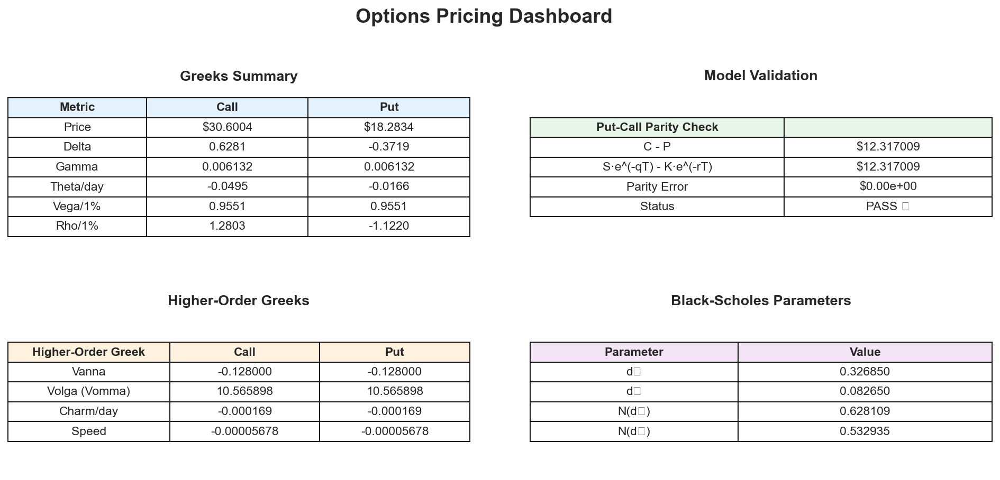

#### 2. Greeks vs. Spot Price
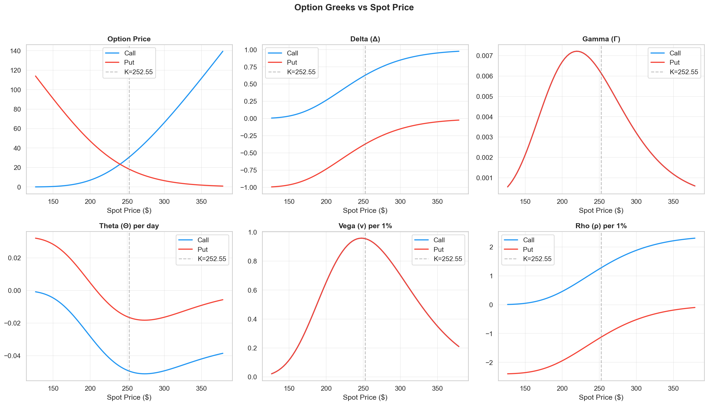

#### 3. Greeks vs. Time
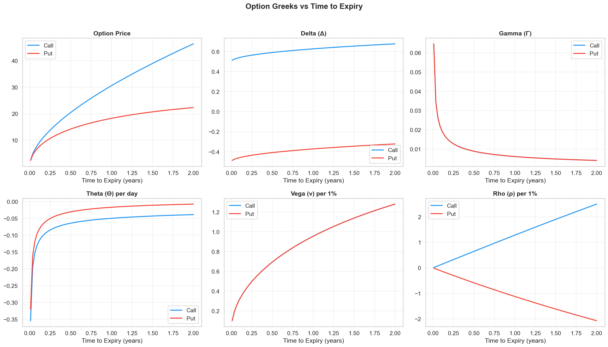

#### 4. Price Surface (3D)
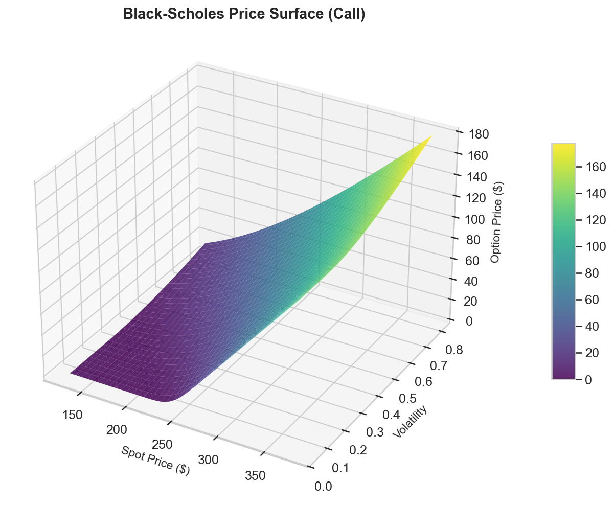

#### 5. Delta Surface (3D)
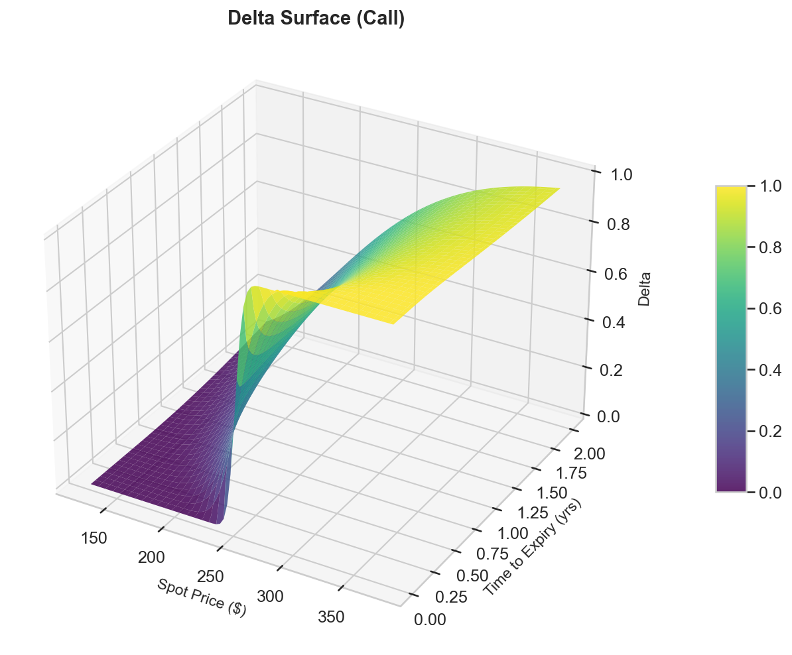

#### 6. Gamma Surface (3D)
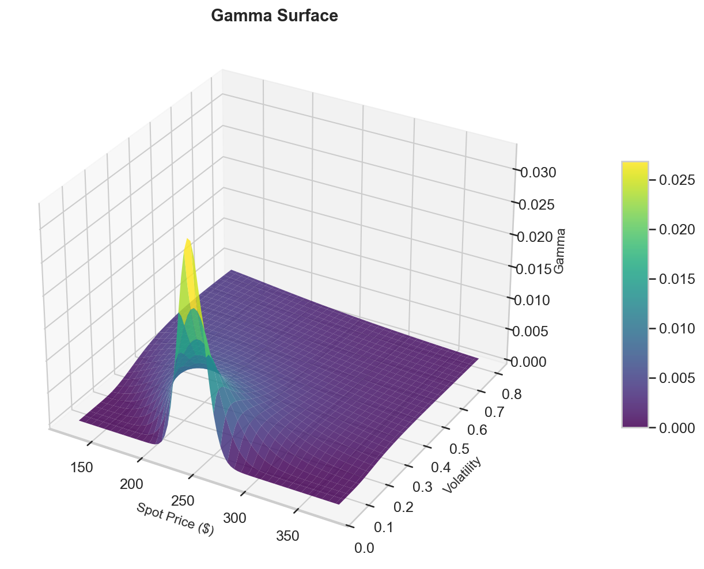

#### 7. Theta Surface (3D)
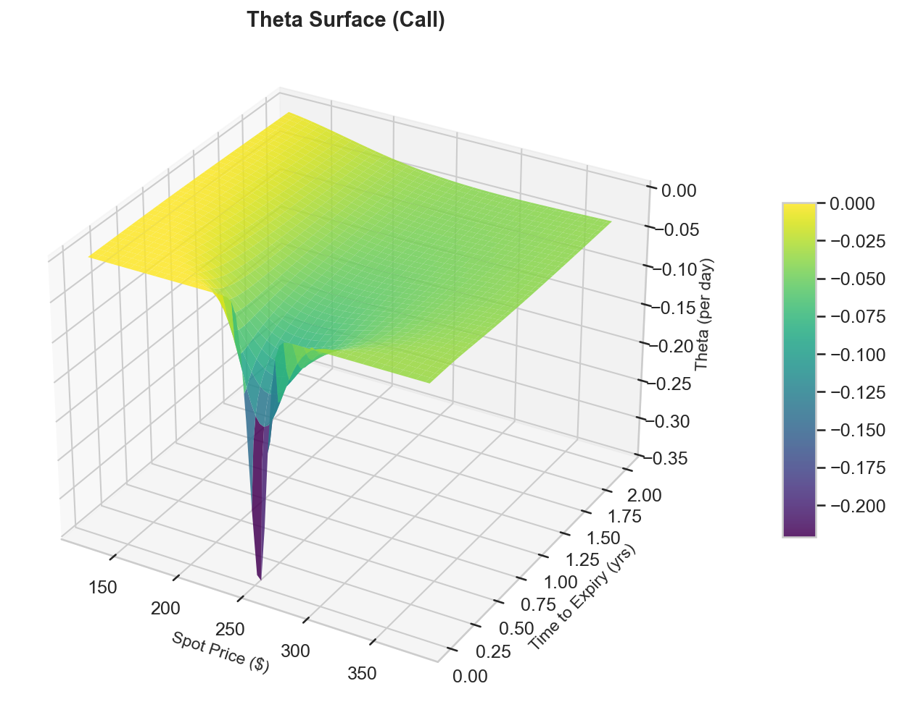

#### 8. Scenario Heatmap
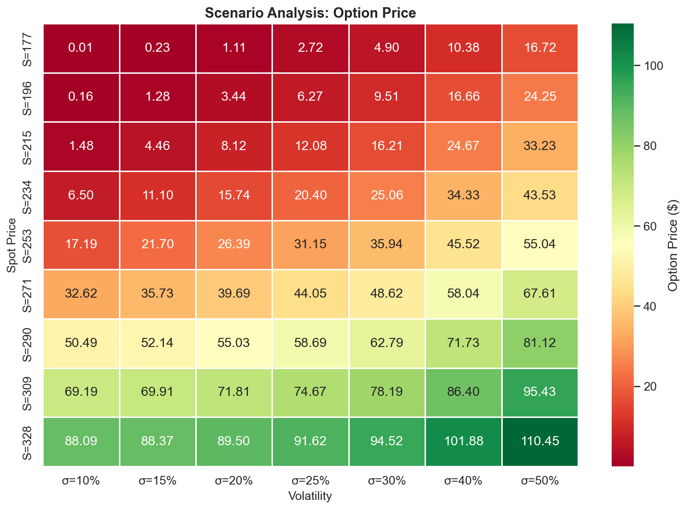

#### 9. P&L Diagram
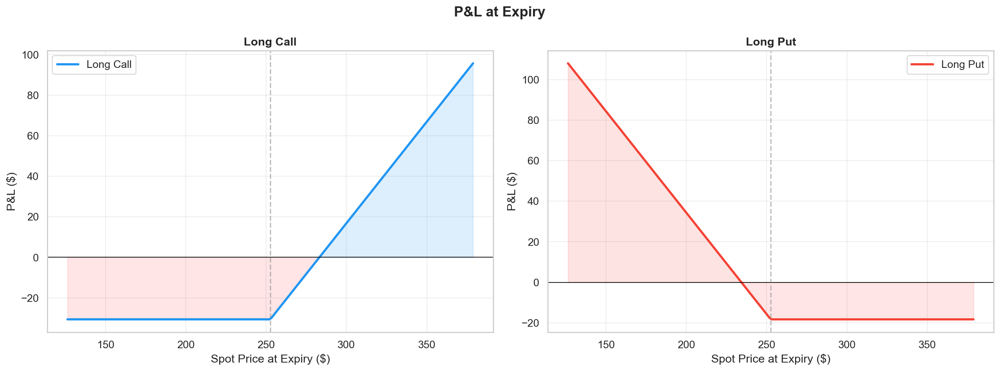

#### 10. Monte Carlo Paths
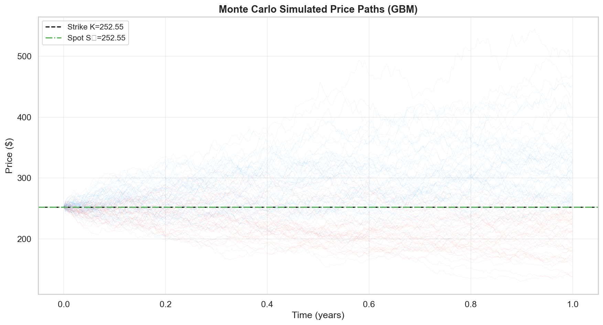

#### 11. Monte Carlo Distribution
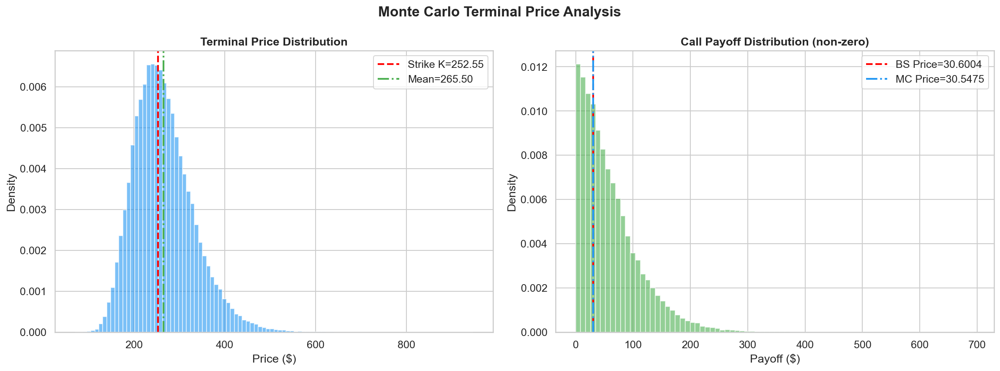

#### 12. Monte Carlo Convergence
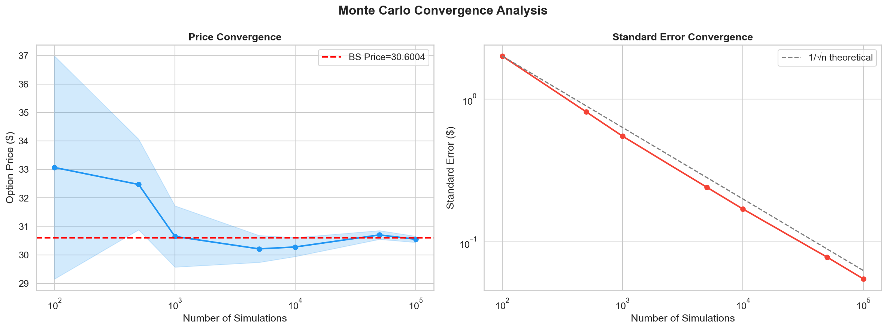

#### 13. Implied Volatility Convergence
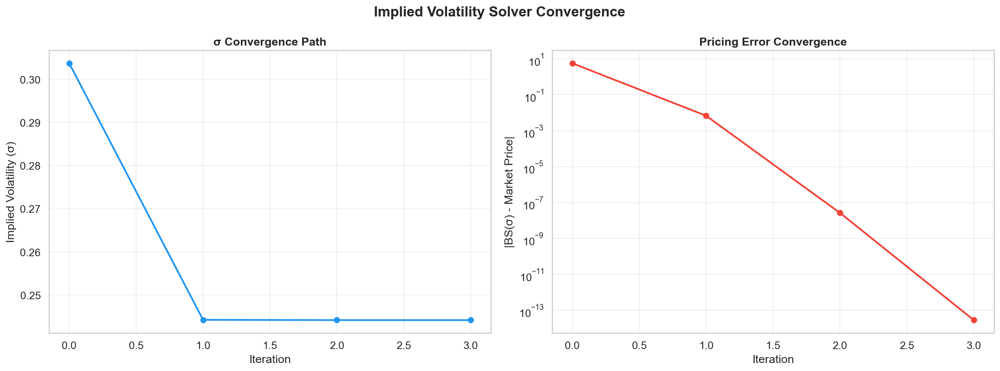

#### 14. Volatility Smile
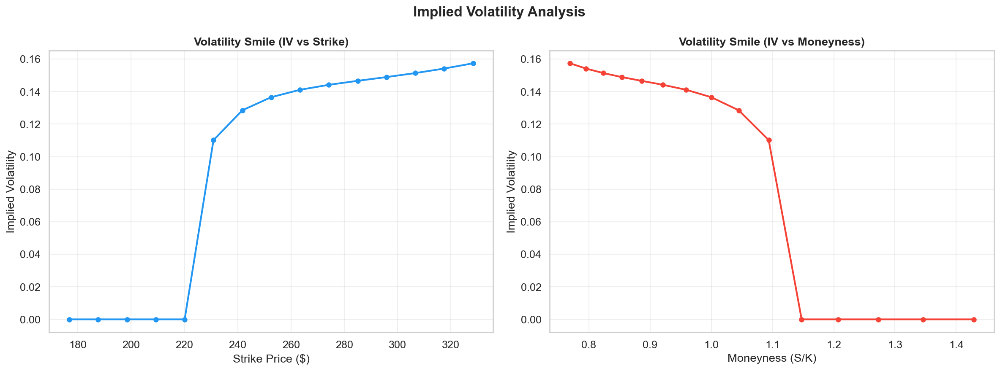

<br>

## Streamlit Web App

The interactive web application provides **7 analysis pages:**

| Page | Features |
|------|----------|
| **Dashboard** | KPI cards, Greeks badges, P&L chart, full pricing table |
| **Greeks Analysis** | Interactive 2D plots (vs spot, vs time) + rotatable 3D surfaces |
| **Monte Carlo** | Animated paths, terminal distributions, convergence analysis |
| **Implied Volatility** | Newton-Raphson convergence, volatility smile plots |
| **Sensitivity Analysis** | 3D price surfaces, scenario heatmaps, parameter sweeps |
| **Stock Analysis** | Candlestick chart, volume, return distribution, historical vol |
| **Report Generator** | One-click PDF report download with all analysis results |

### Launch

```bash
streamlit run app.py
```

**How it works:**
1. Enter any stock ticker (AAPL, TSLA, MSFT, GOOGL, etc.)
2. Click **Fetch & Analyze** — auto-fills spot price and volatility from live data
3. Adjust option parameters (strike, expiry, rate, vol) in the sidebar
4. Navigate through all 7 analysis pages — everything recomputes in real-time
5. Generate and download a PDF report on the Report Generator page

<br>

## Testing

### Test Suite Overview

```
tests/
├── test_black_scholes.py    22 tests
│   ├── TestBlackScholesPricing (7 tests)
│   │   ├── ATM call/put pricing accuracy
│   │   ├── Deep ITM/OTM boundary behavior
│   │   ├── Near-zero volatility convergence
│   │   └── Put-call parity (with and without dividends)
│   ├── TestGreeks (9 tests)
│   │   ├── Delta range [0,1] for call, [-1,0] for put
│   │   ├── Call-Put delta relation (Δ_C - Δ_P = 1)
│   │   ├── Gamma positivity
│   │   ├── Theta negativity for long positions
│   │   ├── Vega positivity
│   │   └── Deep ITM/OTM delta limits
│   ├── TestHigherOrderGreeks (2 tests)
│   │   ├── Vanna vs finite-difference approximation
│   │   └── compute_all() returns all fields
│   └── TestEdgeCases (3 tests)
│       ├── Very short expiry
│       ├── Very high volatility
│       └── Dividend effect on call price
│
├── test_monte_carlo.py      7 tests
│   ├── MC call/put convergence to BS price
│   ├── Antithetic variates reduce variance
│   ├── Path shape validation
│   ├── Convergence analysis structure
│   ├── Price positivity
│   └── 95% CI contains BS benchmark
│
└── test_implied_vol.py      6 tests
    ├── IV recovery at known vol (low/mid/high)
    ├── Put IV recovery
    ├── OTM option IV
    └── Volatility smile construction
```

### Running Tests

```bash
# Full test suite with verbose output
python -m pytest tests/ -v

# With coverage report
python -m pytest tests/ --cov=src --cov-report=term-missing

# Specific module
python -m pytest tests/test_black_scholes.py -v
```

<br>

## CLI Reference

```bash
python main.py [OPTIONS]

Options:
  --ticker TEXT       Stock ticker symbol (default: AAPL)
  --spot FLOAT        Spot price — overrides market data
  --strike FLOAT      Strike price — defaults to spot (ATM)
  --expiry FLOAT      Time to expiry in years (default: 1.0)
  --rate FLOAT        Risk-free rate (default: 0.05)
  --vol FLOAT         Volatility — overrides historical vol
  --dividend FLOAT    Continuous dividend yield (default: 0.0)
  --mc-sims INT       Monte Carlo simulation count (default: 100000)
```

### Examples

```bash
# TSLA 6-month ATM option with 45% vol
python main.py --ticker TSLA --expiry 0.5 --vol 0.45

# MSFT with custom strike and dividend
python main.py --ticker MSFT --strike 400 --dividend 0.008

# High-precision Monte Carlo
python main.py --ticker AAPL --mc-sims 500000
```

<br>

## Dependencies

| Package | Version | Purpose |
|---------|---------|---------|
| `numpy` | ≥1.24 | Numerical computation, array operations |
| `scipy` | ≥1.10 | Normal distribution (CDF/PDF), statistical functions |
| `matplotlib` | ≥3.7 | Static publication-quality plots |
| `seaborn` | ≥0.12 | Statistical visualization themes |
| `pandas` | ≥2.0 | DataFrames for tabular analysis |
| `yfinance` | ≥0.2.18 | Yahoo Finance market data API |
| `plotly` | ≥5.0 | Interactive 3D charts in Streamlit |
| `streamlit` | ≥1.30 | Web application framework |
| `fpdf2` | ≥2.7 | PDF generation for thesis document |
| `reportlab` | ≥4.0 | Advanced PDF report generation |
| `pytest` | ≥7.3 | Unit testing framework |

<br>

## Potential Extensions

| Extension | Method | What It Addresses |
|-----------|--------|-------------------|
| **American Options** | Binomial/Trinomial Trees, Longstaff-Schwartz LSM | Early exercise premium |
| **Stochastic Volatility** | Heston Model (1993) | Volatility smile/skew |
| **Jump-Diffusion** | Merton (1976) | Fat tails, crash risk |
| **Local Volatility** | Dupire (1994) | Exact smile calibration |
| **Exotic Options** | MC + PDE methods | Barrier, Asian, Lookback, Digital |
| **Fast Greeks** | Adjoint Algorithmic Differentiation (AAD) | Real-time risk at scale |
| **Portfolio Risk** | Multi-asset correlated simulation | VaR, CVaR, stress testing |
| **Real-Time Pricing** | WebSocket feeds + streaming | Live trading signals |

<br>

## References

1. **Black, F. & Scholes, M.** (1973). "The Pricing of Options and Corporate Liabilities." *Journal of Political Economy*, 81(3), 637-654.
2. **Merton, R.C.** (1973). "Theory of Rational Option Pricing." *The Bell Journal of Economics and Management Science*, 4(1), 141-183.
3. **Hull, J.C.** (2022). *Options, Futures, and Other Derivatives*, 11th Edition. Pearson.
4. **Brenner, M. & Subrahmanyam, M.G.** (1988). "A Simple Formula to Compute the Implied Standard Deviation." *Financial Analysts Journal*, 44(5), 80-83.
5. **Glasserman, P.** (2003). *Monte Carlo Methods in Financial Engineering*. Springer.
6. **Heston, S.L.** (1993). "A Closed-Form Solution for Options with Stochastic Volatility." *The Review of Financial Studies*, 6(2), 327-343.
7. **Shreve, S.E.** (2004). *Stochastic Calculus for Finance II: Continuous-Time Models*. Springer.

<br>

---

<div align="center">

**Built with Python, Mathematics, and a deep appreciation for quantitative finance.**

</div>
